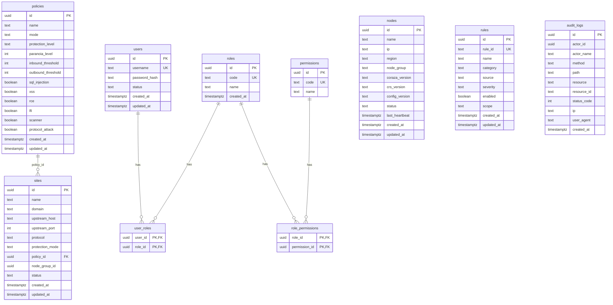

# ER 图

```mermaid
erDiagram
    policies ||--o{ sites : "policy_id"
    users ||--o{ user_roles : has
    roles ||--o{ user_roles : has
    roles ||--o{ role_permissions : has
    permissions ||--o{ role_permissions : has

    sites {
        uuid id PK
        text name
        text domain
        text upstream_host
        int upstream_port
        text protocol
        text protection_mode
        uuid policy_id FK
        uuid node_group_id
        text status
        timestamptz created_at
        timestamptz updated_at
    }

    nodes {
        uuid id PK
        text name
        text ip
        text region
        text node_group
        text coraza_version
        text crs_version
        text config_version
        text status
        timestamptz last_heartbeat
        timestamptz created_at
        timestamptz updated_at
    }

    policies {
        uuid id PK
        text name
        text mode
        text protection_level
        int paranoia_level
        int inbound_threshold
        int outbound_threshold
        boolean sql_injection
        boolean xss
        boolean rce
        boolean lfi
        boolean scanner
        boolean protocol_attack
        timestamptz created_at
        timestamptz updated_at
    }

    rules {
        uuid id PK
        text rule_id UK
        text name
        text category
        text source
        text severity
        boolean enabled
        text scope
        timestamptz created_at
        timestamptz updated_at
    }

    users {
        uuid id PK
        text username UK
        text password_hash
        text status
        timestamptz created_at
        timestamptz updated_at
    }

    roles {
        uuid id PK
        text code UK
        text name
        timestamptz created_at
    }

    permissions {
        uuid id PK
        text code UK
        text name
    }

    user_roles {
        uuid user_id PK,FK
        uuid role_id PK,FK
    }

    role_permissions {
        uuid role_id PK,FK
        uuid permission_id PK,FK
    }

    audit_logs {
        uuid id PK
        uuid actor_id
        text actor_name
        text method
        text path
        text resource
        text resource_id
        int status_code
        text ip
        text user_agent
        timestamptz created_at
    }
```
